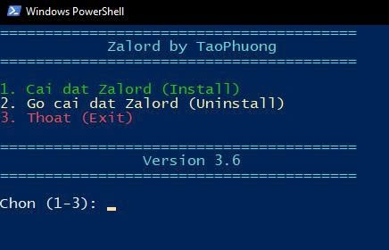

# Zalord - Zalo Enhancement Suite 🚀

**Zalord** là một bộ công cụ tinh chỉnh mạnh mẽ dành cho Zalo PC, mang đến trải nghiệm người dùng mới mẻ với giao diện tùy biến, tính năng nâng cao và quyền riêng tư tốt hơn.

---

## ✨ Tính Năng Nổi Bật

- **🎨 Custom Background**: Tùy chỉnh hình nền khung chat theo sở thích.
- **💧 Blur Effects**: Hiệu ứng làm mờ (Glassmorphism) sang trọng cho giao diện.
- **✍️ Font Customizer**: Thay đổi font chữ toàn bộ ứng dụng (Hỗ trợ Google Fonts).
  - _Mặc định menu sử dụng font **Play** hiện đại._
- **💬 Message Customization**: Tùy biến hiển thị tin nhắn.
- **😊 Custom Reactions**: (Beta) Tùy chỉnh cảm xúc phản ứng nhanh.
- **🛠️ UI Enhancements**: Tinh chỉnh giao diện gọn gàng, hiện đại hơn.

## � Giao Diện (Screenshots)

  
  

  <b>Giao diện Installer (Trái) & Bảng Cài Đặt Full (Phải)</b>

  
   
  <b>Menu truy cập nhanh bên trái</b>

## �📦 Hướng Dẫn Cài Đặt

### Cách 1: Sử Dụng Installer (Khuyên Dùng)

1.  Tải về và chạy file `Zalord v3.6.exe`.
2.  Chọn lựa chọn 1. Install Zalord .
3.  Đợi quá trình cài đặt hoàn tất (khoảng 30 giây).
4.  Mở Zalo và trải nghiệm giao diện mới!

### Cách 2: Cài Đặt Thủ Công

1.  Giải nén source code.
2.  Copy file `app.asar` vào thư mục resources của Zalo (thường là `%LOCALAPPDATA%\Programs\Zalo\Zalo-xx.xx.xx\resources\`).

## 🔄 Gỡ Cài Đặt / Khôi Phục

Nếu bạn muốn quay lại Zalo gốc:

1.  **Cách 1:** Chạy file `Zalord v3.6.exe` và chọn Uninstall.
2.  **Cách 2:** Tự khôi phục thủ công:
    - Truy cập thư mục `resources` của Zalo.
    - Xóa file `app.asar` hiện tại (của Zalord).
    - Đổi tên file `app.asar.backup` thành `app.asar`.

> **Lưu ý:** File backup gốc luôn được tạo tự động trong lần cài đặt đầu tiên.

## ⚠️ Yêu Cầu Hệ Thống

- Zalo PC phiên bản mới nhất (24.x trở lên).
- Windows 10 hoặc Windows 11.
- Quyền Administrator (để trình cài đặt hoạt động tốt nhất).

## ❓ Câu Hỏi Thường Gặp (FAQ)

**Q: Zalord có an toàn không? Có lấy dữ liệu tin nhắn không?**

> **A:** HOÀN TOÀN KHÔNG. Zalord chỉ can thiệp vào tầng giao diện (UI/CSS/JS frontend), không đụng chạm đến mã hóa đầu cuối hay gửi dữ liệu ra ngoài. Mã nguồn mở và có thể kiểm tra.

**Q: Khi Zalo cập nhật phiên bản mới thì sao?**

> **A:** Khi Zalo update, file `app.asar` sẽ bị ghi đè về mặc định. Bạn chỉ cần chạy lại Installer của Zalord là xong.

**Q: Tôi có thể cài trên nhiều máy tính không?**

> **A:** Thoải mái! Zalord miễn phí và không giới hạn thiết bị.

## 📧 Liên Hệ & Hỗ Trợ

- **Tác giả:** TaoPhuong
- **Facebook:** [fb.com/]
- **Zalo:** 0979641xxx
- **Donation:** VIETCOMBANK | 0461000644843 | LE VAN BINH PHUONG

---

  © 2026 Zalord - Made with ❤️ in Vietnam

